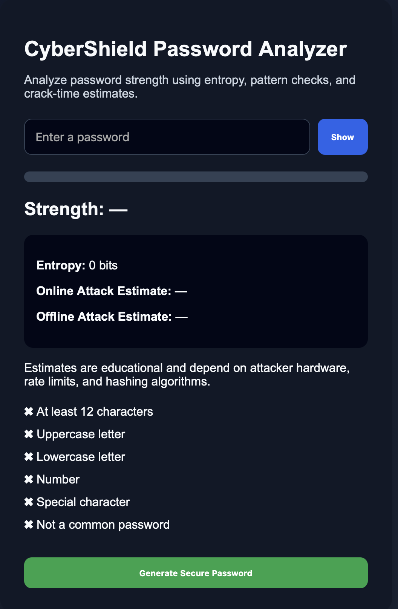
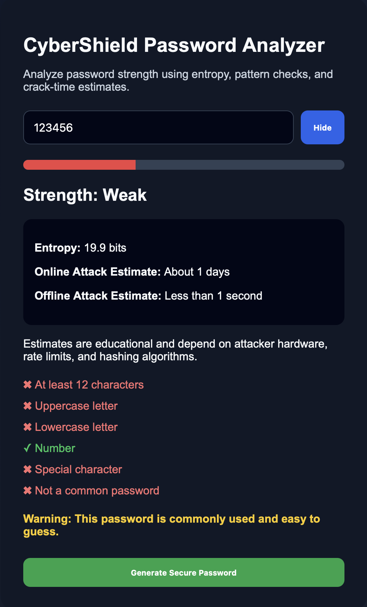
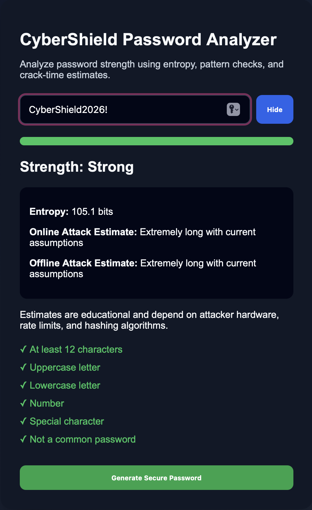

# CyberShield Password Analyzer

CyberShield Password Analyzer is a front-end cybersecurity project that helps users understand why certain passwords are stronger or weaker than others. Instead of only saying "weak" or "strong," the tool explains password strength using length, character variety, entropy, common password checks, and estimated crack times.

## Live Demo
[View the live project here](https://andy-m049.github.io/Password-Strength-Checker/)

## GitHub Repository
[View the code here](https://github.com/andy-m049/Password-Strength-Checker/tree/main)

## Project Overview
I built this project because I wanted to better understand how password strength is measured in real-world security. Many users create passwords that look strong but are still predictable, such as using names, dates, simple substitutions, or common words.

This analyzer checks passwords in real time and gives users feedback based on security concepts like entropy, brute-force resistance, and online versus offline attack scenarios.

## Features
* Real-time password strength analysis
* Password entropy calculation
* Online attack estimate (with rate-limiting assumptions made explicit)
* Offline attack estimate
* Common password detection
* Secure password generator
* Password visibility toggle
* Responsive user interface

## Security Concepts Demonstrated
* Password entropy
* Brute-force attacks
* Online vs. offline attacks
* Common password risks
* Client-side password analysis
* Secure password recommendations

## Security Design Decisions
While building this project, I made several design choices to better reflect real-world password security:

* Passwords are analyzed directly in the browser and are not sent to a server.
* Crack-time estimates are separated into online and offline attacks because the risk level is different — an online attacker is usually rate-limited by the login system, while an offline attacker (working from a stolen password database) is not.
* Crack-time math assumes an attacker finds the password after searching, on average, half of the total possible combinations, rather than assuming they always search the entire keyspace.
* The online attack estimate is explicitly labeled as assuming no lockout, and is capped past a realistic threshold (100 years) with a plain-language explanation instead of a technically-true but meaningless number like "centuries." In practice, real login forms lock accounts or add delays after a handful of failed attempts, so brute-forcing a live login uninterrupted isn't a realistic threat model; this tool makes that assumption visible rather than hiding it behind a raw number.
* Common passwords are flagged because entropy alone can overestimate password strength; a password can look mathematically random while still being a well-known, easily guessed word.
* Users are given feedback so they understand how to improve their password.
* Crack-time estimates are educational and depend on attacker hardware, rate limits, hashing algorithms, and storage practices.

## Screenshots
### Main Interface


### Password Analysis Example




## How It Works
The analyzer checks whether a password includes:
* At least 8 characters
* Uppercase letters
* Lowercase letters
* Numbers
* Special characters
* Protection against common password choices

The tool then estimates password strength based on entropy and pattern complexity. Stronger passwords usually have more length, more randomness, and less predictable structure.

## Example Analysis Flow
```text
User enters password
        ↓
Password is checked for length and character variety
        ↓
Common password patterns are detected
        ↓
Entropy is calculated
        ↓
Online and offline crack-time estimates are displayed
        ↓
User receives feedback and recommendations
```

## Technologies Used
* HTML
* CSS
* JavaScript
* GitHub Pages

## What I Learned
One challenge I ran into was finding a way to estimate password strength without relying only on a basic checklist. I learned that a password can meet common requirements, like having uppercase letters, numbers, and symbols, while still being predictable.

While testing the crack-time estimates, I noticed something that didn't add up: the online attack estimate could show numbers in the hundreds of years for passwords that felt only moderately strong. Digging into it, I realized the math was assuming an attacker could guess continuously, forever, without ever being rate-limited or locked out; which isn't how real login systems behave. This pushed me to make that assumption explicit in the UI and cap the estimate past a realistic threshold instead of displaying a technically-correct but meaningless number. It also reframed how I think about the two estimates: the online number is really a best-case defense assumption, while the offline number is the more realistic threat model, since it reflects what happens after a database breach with no rate-limiting to rely on.

Through this project, I improved my understanding of password entropy, brute-force attacks, client-side validation, and how to explain cybersecurity concepts through a usable web application.

## Future Improvements
* Add more advanced pattern detection (e.g. keyboard patterns like "qwerty123", simple substitutions like "p@ssword")
* Add password history warnings
* Improve mobile responsiveness
* Add a larger common-password list
* Add more detailed explanations for each strength rating
* Let users adjust the assumed offline guess rate to see how hashing algorithm choice (e.g. bcrypt vs. an unsalted fast hash) changes real-world crack time

## Disclaimer
This tool is for educational purposes only. Crack-time estimates are not guarantees. Actual password security depends on attacker hardware, rate limits, hashing algorithms, password storage practices, and whether the password has appeared in previous data breaches.
# Cybershield-Password-Analyzer
